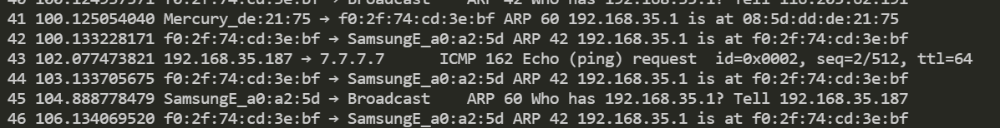

# Arp Spoofing from CYDF 300

Working Example of Arp Spoofing.

1. Finds mac of sender, target
2. Poison Sender's Arp table by sending malicious Arp packet (constructed to have target's mac address)
3. Constantly refreshed sender's arp table
4. Relay other packets, so they can be seemlessly transfered.

Tested on Android Device : all the packets were exposed to the attacker,
(even though there are some packet losses)

You can verify this yourself by varying the length of the packets sent by the sender's device. (We use pinging packet) in this case for varification. Returned output should look something like this:

From tshark (`sudo tshark -f "arp || icmp"`)

  

Which matches the log from main.cpp

  

